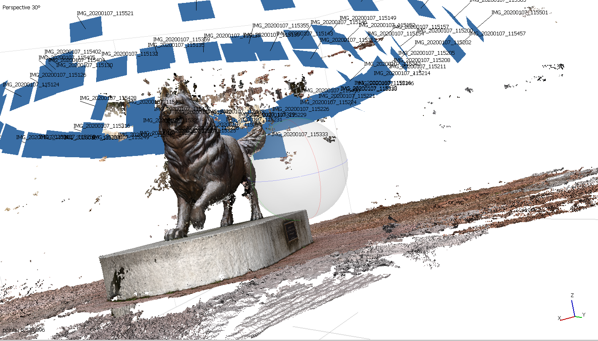
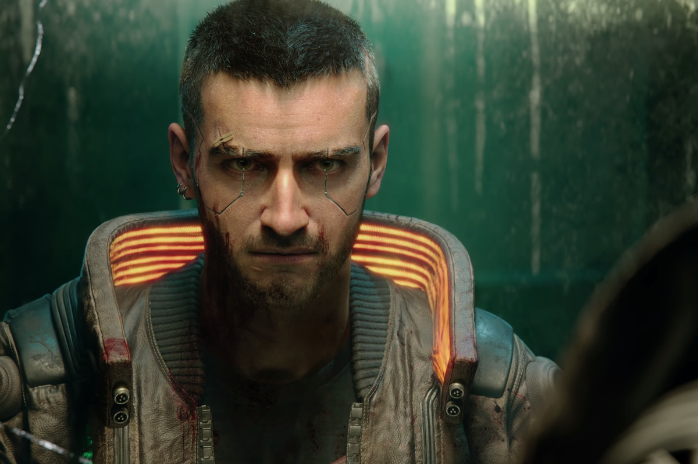

# GIS FINAL PROJECT: CV_ML_SUR

**Instructor:** Bo Zhao, SMI 416B, Office hours by appointment
**Student:** Oliver Nie
**Contact:**  wn5@uw.edu

## **1. Prologue**

### **Course**
Approaching the end of this quarter, Professor. Bo Zhao has contributed an incredible amount of work to GEOG 458, which inspired a lot of students to explore the cutting edge of technology. In general, we went through topics like digital geography (as known as GIS), web programming, geospatial data, web mapping, map design, geo-narratives, point cloud and computer vision (as known as CV). Besides the cutting edge of technology, we also went through critical thinking processes focusing on the ethical issue and human-tech relationship.

With the ongoing protest, people felt powerless and chaotic. This is largely related to the lack of regulation and law enforcement. Although there are plenty of peaceful protesters out there challenging the racial discrimination, there are some anarchists and criminals who blend into the crowd. How can we change this problem? What should we do to ensure the dignity and purity of peaceful protest? With these questions in mind, I begin this project. Base on my personal interest, I would like to challenge myself at the cutting edge of technology --- Machine learning and the use of computer vision.

### **Justification:**
Geographic information system, as known as GIS, is an interactive system with elements relating to geography. This project explores the connection between geographic reference, 3D mapping, VR embodiment, computer vision, and LIDAR. In this project, I am trying to achieve a potential problem for the protest surveillance system through the combination usage of GIS. The goal of this project is to protect innocent people from unnecessary suffering. Also, the project wants to minimize the damage of riots/criminals/anarchists who blend into the crowd and use “peaceful protest” as an excuse. Overall, this project is ambitious and difficult to achieve, but it is a worthy challenge to start.

## **2. Background Information:**
### **Clients**
As I described in the prologue section, this project wants to help the purity of peaceful protest and law enforcement. Thus, this project is considered as an assistant tool for civil service. Especially considering all the potential problems with privacy and surveillance, the database/server should be strictly restricted to authorized organizations. However, there is a certain need for civilians to decide a third party to be involved in as separation of powers.

### **Server**
From the design perspective, a large database would be required. The function of this database is only about storing images.

### **Services**
First of all, this project is attempting to connect the point cloud and computer vision together to enhance our current law enforcement and evidence documentation capability. Then, I am going to use computer vision(CV) and machine learning to analyze or investigate a further step of the information. In terms of bullet points, these are the three main steps.
<ul>
<li>Point Cloud reconstruction</li>
<li>CV/ML analysis</li>
<li>Portable device / Use in actual life</li>
</ul>

In general, I am going to reconstruct a 3D model/3D environment first. The goal of doing this is to ensure a sense of space and realistic scene recreation. Then, the CV and ML analyses are going to asset the process of determination. I am expecting that I can use machine learning to determine the behaviors of a particular action with the help of computer vision. After this previous two stages, the idealistic final step for this project is to be accessible on any sort of device including phone, PC and laptop.

### **Data**
There are going to be three types of data.
<ul>
<li>
Image data (include human behaviors and geographical environment)
</li>
<li>ML / CV Model (training model and testing model)</li>
<li>3D Model (scene reconstruction)</li>
</ul>

_This image is a 3D model/point cloud recreation_

_This image is an example of normal image before using CV_

## **3. Project insight**
In the original design, the data which flow in between the client and server contains a lot of photos. These photos are going to help the 3D model software to reconstruct the whole realistic scene. Under the most idealistic situation, the 3D model is expected to be a series of models, which would provide the most accurate documentation of the crime scene.

There are a lot of major libraries in the use of this project.
<ul>
<li> Numpy </li>
<li> Os </li>
<li> OpenCV </li>
<li> Sys </li>
<li> Glob </li>
<li> Keras </li>
<li> Tensorflow </li>
</ul>
Numpy is a Python library. It is widely used in multi-dimensional arrays and matrices. The current version of the ML/CV section is relying heavily on image recognition. The computer takes in the image and recognizes it in matrix form. It is somehow connecting to week 8, that Point Cloud visualization is another form of the matrix transformation. The values of the matrix are all calculated through their vector position and RGB color charts. In such a method, the programmer can extract and condense everything into a matrix formula, which is helpful for the computer to operate. OpenCV is another programming library, which is designed for real-time CV. The OpenCV package is crucial for our image processing phase because OpenCV allows an automatic classification to simplify the complicated images. Keras, on the other hand, was an API base on Tensorflow assisting the phase of recognition.

This project does not support responsive design. However, users have the ability to reshape or reform any aspect of this project if they have a profound understanding of CV/ML programming skills.

### **Strength and Weakness**
**Pro:**
The existing version of this project is not an easy task at all. To be honest, this project’s difficulty should not even be considered as a final project. However, I choose to do this project at this specific time, not because this is easy, but because this is what society needs. There is a certain level of possibility that this project could permanently reshape all of the human rights movement.

Since this project was established on the 3D models, it counters the idea of fake geography. With the georeference of a 3D environment, fake geography is hard to achieve due to the fundamental visual symbols and GPS reference. To create a 3D model, images need Georeference for collaboration, which indicates that any human-action in changing the data would visually distort the 3D model eternally.

The involvement of OpenCV and ML are impactful on the topics. With the help of ML, facial recognition and object recognition are no longer constrained to human workload. With enough labeling data and information, ML can serve as a future judge or government agency. On the other hand, OpenCV is more like a sidekick in this project. It contributed more towards simple images and extraction in detail. However, I also see another potential branch of the divergent project --- copy&rights law.

**Con:**
Affordability: One of the few major weaknesses exposed in this project is the PC/hardware standard. This is an essential condition to meet. In order to prevent injustice and mistaken law decision, the 3D models and ML need to be as accurate as possible. Contemporary, all the GPU and CPU are expensive to purchase.

Time: Execution is another hard part of this project. As I mentioned previously, this project probably needs more people, resources, and time to achieve. The existing version is nothing but a scratch of ideas.

Copyrights: Although most of the programs and libraries in this project are open-source, there are few processes relying on third-party software. To construct the 3D models, I used Agisoft Metashape. For the visual appearance, I picked potree software to present the point cloud on the web.

### **Ethics**
Despite all of my intention, I can hardly deny the terrifying consequence of abusing this modern technology. Be more specific, this project could be dangerous and unethical with inappropriate stakeholders and officials. The major concern of this project is the abuse of surveillance. Implement the whole facial recognition to prevent crimes has been one of the most popular sci-fi themes. Until these days, the use of surveillance is somehow in hot water. For some other countries like China, this technology has been widely accepted (by the government） and assigned in modern cities. Professor. Bo Zhao also provided these readings in the external material session(AI powered CCTV in China and Digital contact tracing). How can we justify the Digital contact tracing and AI-powered CCTV?

In my personal opinion, the public shaming and the afterward tracing are the most awful moral downfall. This shady aspect would accept the sacrifice or the violation against freedom of speech. It only wants to create a good for the utility. It could permanently damage the voice of some marginal groups/minorities. This approach of misinformation would be in favor of the majority(majority has the strong power to regulate information), which could potentially lead the whole information control to an anti-utopia or 1984 liked world where everything is heavily controlled and implemented for the general good. Especially, this can strongly relate to the abuse of AI/ML. Individuality in this kind of society would be considered as meaningless or necessary sacrifices for the public.

To prevent this, the public/citizens need to have an indispensable power splitting system. This sort of surveillance technology shall also be limited to the use of occasions, time, events, and levels. In this project, everything should only limit to the protest period. The cameras are attached to drones and only would be activated once criminal behaviors appeared. Every single footage should be delivered to the legal organizations and review committee.

Furthermore, privacy is another significant aspect of ethical evaluation. Where should the database locate at? Who should have access to the data? Should we allow citizens to access the dataset? A similar discussion was brought up in Week3 and Week2. With everything pushing our boundary of GIS towards every aspect of life, the creation of 3D model/cloud visualization is getting easier and easier than ever before. The infrastructure behind algorithms and database have a central role in privacy responsibility.

### **Social Theory**
Privacy and freedom of speech are highly valued spirits for humanity. These are considered as the most essential human rights of individuality and self-expression. In modern days, platforms use community guidelines to regulate hate speech, criminal behaviors, and conflicts. However, as technology becomes more and more portable and accessible in any location at any time. How should we evaluate privacy in common areas? Meanwhile, the government is unavoidably reaching further and further to the cutting edge of technology. The foundation of 5G and new public systems are hard to achieve without support from the government.

## _Code Inspiration / Open source materials:_
[TensorFlow] (https://www.tensorflow.org/tensorboard/tensorboard_in_notebooks)

[TensorFlow Object detection] (https://www.tensorflow.org/lite/models/object_detection/overview)

[OpenCV Extraction HR/VR lines] (https://docs.opencv.org/3.4/dd/dd7/tutorial_morph_lines_detection.html)
